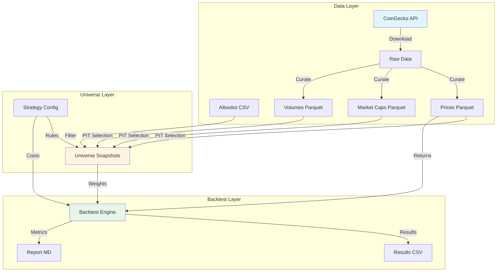

# Architecture

## System Overview

The crypto backtest platform is designed with a clear separation between data, universe selection, and backtesting logic.

## Key Concepts

### Universe vs Basket

- **Universe**: The complete dataset of all assets across all dates. This is stored locally in curated parquet files (`prices_daily.parquet`, `marketcap_daily.parquet`, `volume_daily.parquet`). The universe is static once downloaded.

- **Basket**: A selected subset from the universe at a specific rebalance date. The basket is determined using point-in-time (PIT) data - only information available as-of the rebalance date is used. The basket remains frozen (weights don't change) until the next rebalance date.

### Point-in-Time (PIT) Selection

Critical requirement: **Never use future information in the past.**

When building a snapshot for rebalance date `2023-06-01`:
- ✅ Use market cap data from `2023-06-01` or earlier
- ✅ Use listing dates based on first available price in the dataset
- ✅ Use volume averages calculated from data up to `2023-06-01`
- ❌ Never use market cap from `2023-06-02` or later
- ❌ Never use assets that weren't listed yet

## Architecture Diagram



## Data Flow

### 1. Data Download (`scripts/download_data.py`)

```
CoinGecko API → Raw Data → Curated Parquet Files
```

- Fetches daily prices, market caps, volumes for all coins in allowlist
- Handles rate limits and missing coins
- Saves to `data/curated/` as parquet files

### 2. Universe Snapshot Building (`scripts/build_universe_snapshots.py`)

```
Config + Curated Data → PIT Selection → Snapshots
```

For each rebalance date:
1. Load data as-of that date (most recent available ≤ rebalance date)
2. Apply eligibility filters (allowlist, excluded, listing age, mcap, volume)
3. Rank by market cap and select top N
4. Calculate weights (cap-weighted, sqrt-cap, or equal-weight)
5. Save snapshot row: `(rebalance_date, symbol, weight, marketcap)`

### 3. Backtest Execution (`scripts/run_backtest.py`)

```
Snapshots + Prices → Daily Returns → Performance Metrics
```

For each trading day:
1. Check if rebalance date → update weights
2. Compute BTC return (long leg)
3. Compute basket return (short leg) using current weights
4. Long-short return = BTC return - basket return
5. Apply costs on rebalance dates (fees + slippage × turnover)
6. Net return = LS return - costs
7. Build equity curve

## File Structure

```
crypto_backtest/
├── scripts/          # Executable scripts
├── src/              # Reusable modules
│   ├── providers/    # Data providers (CoinGecko)
│   ├── universe/     # Universe selection logic
│   ├── backtest/     # Backtest engine
│   └── reporting/    # Metrics and reporting
├── configs/          # Strategy configs (YAML)
├── data/
│   ├── raw/          # Raw downloaded data (gitignored)
│   ├── curated/      # Processed parquet files (gitignored)
│   └── perp_allowlist.csv  # Perp-eligible coins
├── outputs/         # Backtest results (gitignored)
└── tests/           # Unit tests
```

## Extension Points

### Adding New Data Sources

1. Create new provider in `src/providers/`
2. Implement interface matching CoinGecko provider
3. Update download script to use new provider

### Adding New Strategies

1. Create new config YAML in `configs/`
2. Run existing scripts with new config
3. (Future: add strategy-specific logic in `src/backtest/`)

### Integrating CoinGlass

**TODO**: When ready to integrate CoinGlass for perp eligibility and funding:

1. Add `src/providers/coinglass.py`
2. Update `build_universe_snapshots.py` to use CoinGlass for eligibility
3. Update `run_backtest.py` to apply funding rates in carry model
4. Remove dependency on `perp_allowlist.csv`

## Design Principles

1. **Separation of Concerns**: Data download, universe selection, and backtesting are separate steps
2. **Point-in-Time Correctness**: Never use future information
3. **Reproducibility**: All data is cached locally; backtests are deterministic
4. **Extensibility**: Clean interfaces allow swapping providers and strategies
5. **Simplicity**: MVP first, but keep code clean for future enhancements

