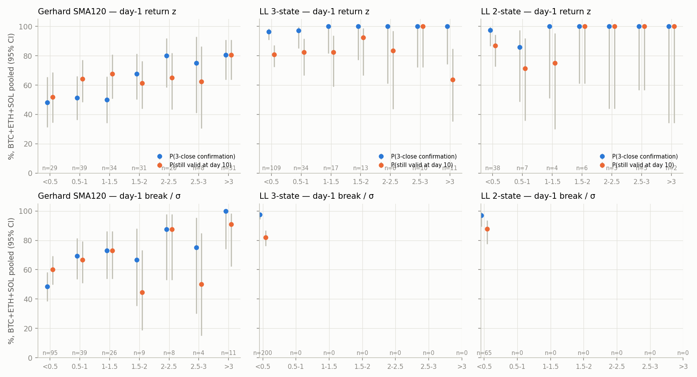
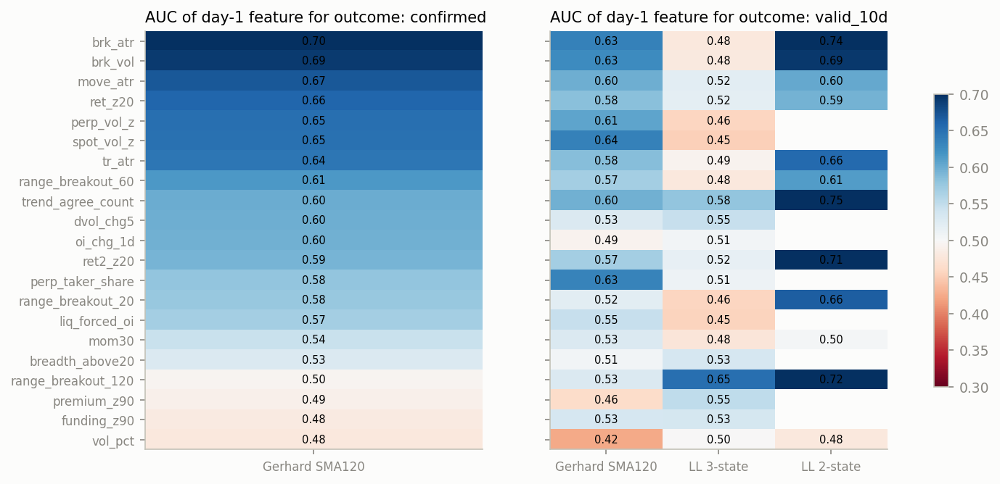
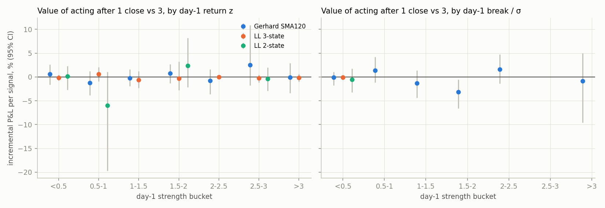
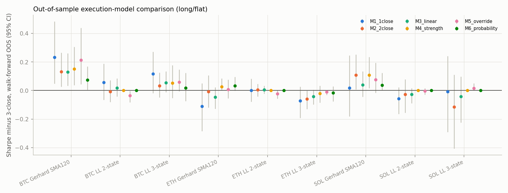
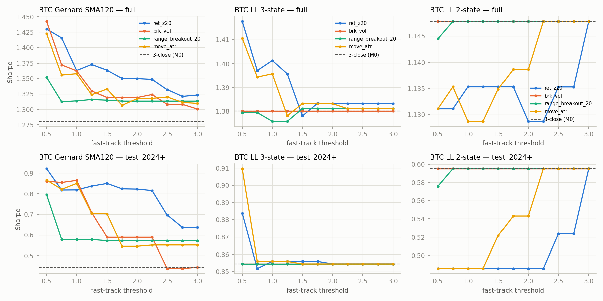
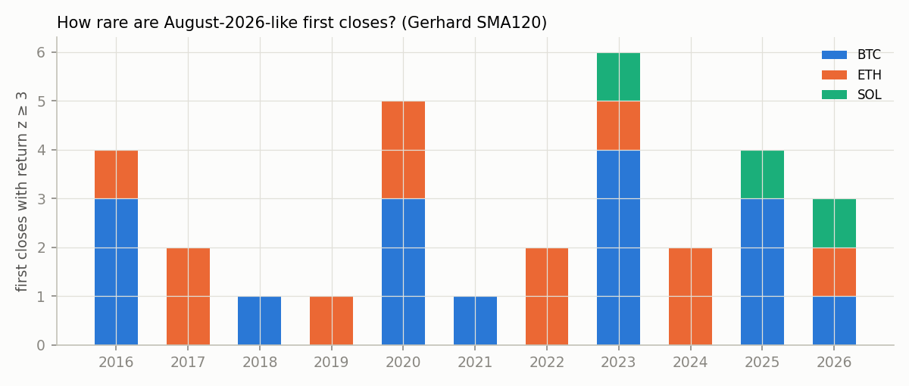

# Trend Confirmation Research (Track A)

*2026-09-15 · research only, no production code changed · reproducible via `python -m track_a.run` (from `research/quant_program`)*

**Run and data**
- **Manifest:** `runs/*_track_a_trend_confirmation/manifest.json`.
- **Tables:** `results/tables/track_a/`.
- **Figures:** `results/figures/track_a/`.

**Scope**
- **Systems:**
  - Gerhard (close vs 120-day SMA);
  - LL Pro reconstruction as **3-state** (Gold / grey / Blue; grey = neutral);
  - LL Pro reconstruction as **2-state** (only Gold/Blue flip; grey resets the count).
- **Assets:** BTC, ETH, SOL (Coinbase daily OHLCV).
- **Implementation:** long/flat primary; long/short on Binance perps with funding as sensitivity.
- **Relation to the earlier study:** this extends `research/btc_confirmation_lag` (BTC only) to three assets, a neutral state, market-confirmation features, trained execution models (M4/M6), walk-forward fitting and explicit waiting-vs-false-entry economics.

## Executive summary

1. **Is the 3-close rule justified? It depends on the asset, and the current rule is right more often than not.**
   - **BTC Gerhard:** possibly too conservative since 2022, not before.
     - Acting earlier improved walk-forward Sharpe by +0.21 to +0.23 vs 3-close (CIs exclude zero).
     - But the gain is −0.05 to +0.01 over 2019–21.
     - About 62% of it comes from *exiting* faster rather than entering faster (§8a).
   - **ETH Gerhard:** the 3-close rule earns its keep. False first signals are frequent (45%) and expensive (−5.4% per failed signal).
   - **SOL:** inconclusive (short history).
   - **LL:** the grey band already filters. 96–100% of first colour closes confirm, so the rule costs and saves little either way.
2. **Day-one signal strength predicts confirmation.**
   - **Best predictors (Gerhard, pooled across assets):** distance through the SMA scaled by ATR or volatility (AUC ≈ 0.70), then return z-score (0.66) and spot/perp volume z (0.65).
   - **Out of sample:** a one-feature logistic model trained before 2022 reaches AUC 0.71 on 2022–26 events.
   - **Funding, basis, liquidations, OI change and breadth add no information** about confirmation.
   - **Longer-horizon persistence** (still valid at day 10) is much less predictable (AUC ≈ 0.60).
3. **Strength predicts confirmation, but that does not make early entry pay everywhere.** On ETH, even strong first closes (≥ 3σ) had negative average 10-day returns. The economic value of acting early is BTC-specific.
4. **Recommendation.**
   - **No production change anywhere** (revised 2026-09-15 after external review; §8a).
   - **BTC Gerhard:** paper-trade two frozen faster-confirmation rules (1-close, and the 0.5σ fast-track), logging
     entries and exits separately.
   - **Everything else:** keep 3 closes.
   - **Paper-trade:** strength-staged entry (M4). It is the only execution model that was non-negative out of sample on all three assets.

---

## 1. Methodology

### 1.1 Events
The confirmation state machine (`track_a/machine.py`) works as follows:
- **Regime and count.** It tracks a confirmed regime R. Each close on a side different from R that keeps the same target increments a counter.
- **Reset.** A close back on R's side, or on a different target, resets the counter.
- **Flip.** At 3 closes the regime flips.
- **Execution.** Decided at the close, executed at the next open, 10 bp per unit turnover.
- **Validation.** Unit tests confirm it reproduces the earlier two-state engine exactly.

**Day-1 event** = the first qualifying close against the confirmed regime, i.e. a transition *toward* long, neutral (LL 3-state only) or short.

| System | BTC | ETH | SOL |
|---|---:|---:|---:|
| Gerhard SMA120 | 68 (32 to-long, 36 to-short) | 74 | 50 |
| LL 3-state | 85 (19 long, 44 neutral, 22 short) | 74 | 41 |
| LL 2-state | 24 | 27 | 14 |

- **Windows:** events from 2016-06 (BTC/ETH) and 2021-11 (SOL) to 2026-09-14.
- **Outcome labels** (known only after the event; never used as features):
  - `confirmed` (3 closes reached);
  - `reversed_early`;
  - `valid_hd` (raw side at close t0+h still on target) for h = 3/5/10/20;
  - forward returns from the next open at 1/3/5/10/20 days, with MAE/MFE.

### 1.2 Day-1 features
All features are computed from data up to the close of day t. Denominators use t−1.

| Group | Features |
|---|---|
| Price / volatility | 1D and 2D return z (10/20/30/60-day vol), move/ATR20, true range/ATR, **break through threshold / ATR and / σ** (for neutral targets: distance back through the band being left), breakout from 20/60/120-day range, gap from 90-day high/low, realised-vol percentile |
| Trend agreement | sign of 10/20/30/60/90/120/200/365-day returns; count agreeing with the transition |
| Market confirmation | Binance spot and perp quote-volume z, taker share, Binance funding z (90-day), perp premium z, CoinGlass OI change, forced-side liquidations / OI, DVOL 5-day change, cross-sectional breadth (share of Binance USDT perps above their 20-day SMA; delisted and TradFi perps excluded) |
| Regime | vol tercile (expanding), bull/bear (365-day return), perp-liquidity regime, weekend, SPX 20-day return (lagged) |

### 1.3 Execution models

| Model | Rule |
|---|---|
| M0 | 3 closes (current) |
| M1 | 1 close |
| M2 | 2 closes |
| M3 | linear staging 1/3 → 2/3 → 1 |
| M4 | **strength staging, fitted on training events.** Exposure after close #1 = isotonic P(confirm \| break/σ or return z) if it exceeds the training break-even probability p\* = L/(G+L); after close #2 = P(confirm \| 2 closes) if it exceeds p\*; otherwise wait. |
| M5 | **strong-signal override.** Enter fully after close #1 if the feature ≥ threshold. Feature ∈ {return z, break/σ, 20-day range breakout, move/ATR}; threshold ∈ 0.5–3.0 in steps of 0.25. Chosen on training Sharpe. |
| M6 | **probability-based.** Logistic P(confirm) on (return z, break/σ, trend-agreement share, perp volume z, vol percentile) mapped to exposure = clip((p − c)/(1 − c)); cutoff c chosen on training data. |

A reset before close #3 unwinds any partial exposure.

### 1.4 Validation
- **Chronological windows:** train ≤ 2021 / validation 2022–23 / test 2024–26-09 for fixed rules and sensitivity tables.
- **Walk-forward:** anchored annual walk-forward (test years 2019–2026; 2023+ for SOL) for M4/M5/M6.
  - Refit each year on events whose outcomes were fully known before the test year (35-day embargo).
  - M0–M3 need no fitting and are evaluated on the same stitched out-of-sample span.
- **Inference:** paired circular block bootstrap (60-day blocks, 2,000 reps) for Sharpe differences; monthly-cluster bootstrap for per-event economics; Benjamini-Hochberg across the AUC tests.
- **Integrity checks (run manifest):**
  - look-ahead truncation probes: passed 9/9;
  - signal-to-execution lag: passed 18/18;
  - duplicate and sorted dates: passed;
  - sparse-turnover sanity: passed after recalibration.

---

## 2. Does Day-1 strength predict confirmation?

**Gerhard SMA120, pooled BTC+ETH+SOL (192 events), by day-1 return z:**

| Return z | <0.5 | 0.5–1 | 1–1.5 | 1.5–2 | 2–2.5 | 2.5–3 | >3 |
|---|---:|---:|---:|---:|---:|---:|---:|
| n | 29 | 39 | 34 | 31 | 20 | 8 | 31 |
| **P(3-close confirmation)** | 48% | 51% | 50% | 68% | 80% | 75% | **81%** |
| P(reversal before confirmation) | 52% | 49% | 50% | 32% | 20% | 25% | 19% |
| P(still valid) 3d / 5d / 10d / 20d | 48/41/52/41% | 64/64/64/59% | 68/62/68/62% | 71/74/61/58% | 65/60/65/65% | 88/75/63/50% | **81/81/81/77%** |
| Forward return 3d / 5d / 10d / 20d (mean) | −1.4/−1.1/−0.9/−6.9% | −1.6/−0.7/−0.3/+1.3% | +0.2/0.0/−0.4/−0.9% | +0.1/+1.3/−0.7/+0.1% | −0.6/−2.5/−0.4/−3.1% | +1.5/−2.7/−3.7/−8.1% | +1.0/+2.9/+3.2/**+4.9%** |
| MAE / MFE 20d (median) | −11.0/+5.4% | −10.9/+9.8% | −7.5/+10.6% | −11.4/+9.5% | −12.7/+10.2% | −16.6/+7.9% | **−4.0/+13.0%** |

**By day-1 break through the SMA (σ units):** confirmation rises from 48% (<0.5σ, n=95) to 69% (0.5–1σ), 73% (1–1.5σ) and 100% (>3σ, n=11).

**Single-feature AUC for confirmation (Gerhard pooled, 119 confirmed vs 73 not):**

| Feature | AUC | BH-adjusted p |
|---|---:|---:|
| break / ATR | **0.70** | <0.001 |
| break / σ | **0.69** | 0.001 |
| move / ATR | 0.67 | 0.004 |
| return z (20-day) | 0.66 | 0.007 |
| perp volume z | 0.65 | 0.04 |
| spot volume z | 0.65 | 0.04 |
| true range / ATR | 0.64 | 0.02 |
| 60-day range breakout | 0.61 | 0.09 |
| trend-agreement count | 0.60 | 0.16 (not significant) |
| OI change | 0.60 | 0.30 (ns) |
| forced-side liquidations / OI | 0.57 | ns |
| breadth | 0.53 | ns |
| basis (premium z) | 0.49 | ns |
| funding z | 0.48 | ns |

**Out of sample (logistic, trained on events before 2022, tested on 128 events from 2022–26):**

| Model | Confirmation AUC | Brier score | Brier (base rate) | 10-day persistence AUC |
|---|---:|---:|---:|---:|
| break/σ alone | **0.705** | 0.211 | 0.233 | 0.59 |
| return z alone | 0.688 | 0.219 | 0.233 | 0.60 |
| strength + trend agreement | 0.683 | 0.210 | 0.233 | 0.59 |

Adding more features did not help out of sample.

**Per asset, the relationship differs:**

| Return z bucket | BTC confirm | BTC fwd 10d | ETH confirm | ETH fwd 10d | SOL confirm | SOL fwd 10d |
|---|---:|---:|---:|---:|---:|---:|
| <0.5 | 73% (11) | +0.6% | **9% (11)** | −5.8% | 71% (7) | +4.3% |
| 0.5–1 | 57% (14) | +4.1% | 56% (18) | −2.8% | 29% (7) | −2.3% |
| 1–1.5 | 60% (15) | +0.7% | 50% (12) | +1.8% | 29% (7) | −6.4% |
| 1.5–2 | 67% (6) | −2.7% | 64% (11) | +6.2% | 71% (14) | −5.3% |
| 2–3 | 100% (6) | +0.5% | 80% (10) | +1.0% | 67% (12) | −3.6% |
| **>3** | 81% (16) | **+6.3%** | 75% (12) | **−2.1%** | 100% (3) | +7.7% |

*Parentheses show n.*

- **ETH:** strength predicts confirmation very strongly (weak first closes almost never confirm), yet big first closes did not produce positive forward returns.
- **BTC:** big first closes both confirmed and paid.

**LL systems:** confirmation is near-certain regardless of strength (96–100%), so strength can't add value there. The first Gold/Blue close is always shallow relative to the band.

---

## 3. Economics: the price of waiting vs the price of false early entry

These figures are the incremental P&L of acting after 1 close (M1) vs 3 closes (M0). They are measured per event over the event window with the full P&L engine, including costs and the gap to the next open (`economics_summary.csv`).

| System · asset | P(confirm) | Cost of waiting per confirmed signal | False-entry loss avoided per failed signal | **Expected value of early entry per signal (95% CI)** | Break-even P(confirm) | Net per year | Worst event |
|---|---:|---:|---:|---:|---:|---:|---:|
| Gerhard · BTC | 71% | +3.7% | 2.5% | **+1.9% [+0.3, +3.8]** | 40% | **+12.7 pp** | −13.2% |
| Gerhard · ETH | 55% | +0.9% | **5.4%** | **−1.9% [−4.1, −0.1]** | 86% | **−14.5 pp** | −30.3% |
| Gerhard · SOL | 60% | +3.2% | 4.8% | 0.0% [−1.5, +1.5] | 60% | −0.1 pp | −14.9% |
| LL 3-state · BTC | 96% | +0.5% | — | +0.5% [−0.1, +1.1] | — | +4.0 pp | −8.1% |
| LL 3-state · ETH | 97% | −0.6% | 13.6% (2 events) | −1.0% [−2.1, 0.0] | — | −7.5 pp | −16.4% |
| LL 3-state · SOL | 100% | +0.3% | — | — | — | +2.8 pp | −5.3% |

**Reading the trade-off.** Early entry pays when P(confirm | day-1 information) exceeds the break-even probability L/(G+L), where G is the cost of waiting and L the false-entry loss.
- **BTC:** break-even is low (40%) because waiting is expensive and false signals cheap. Even the weakest bucket (break < 0.5σ, P = 57%) clears it.
- **ETH:** false entries are expensive and waiting is cheap, so break-even is 86%. Only the strongest buckets clear it, and there is no ETH bucket with a significantly positive expected value.

**By break/σ bucket, expected value per signal of M1 vs M0:**

| Break/σ bucket | BTC | ETH |
|---|---|---|
| <0.5 | +0.5% (n37) | −1.9% (n39) |
| 0.5–1 | +5.0% (n12) | +1.4% (n16) |
| 1–1.5 | +3.1% (n8) | −5.3% (n9, CI < 0) |

**Partial staging reduces the tail.**
- **M3 on BTC:** EV +1.0% per signal [+0.1, +2.0], left-tail 5th percentile −2.1% vs −5.0% for M1.
- **M3 on ETH:** EV −0.8% [−1.8, 0.0].

---

## 4. Execution-model comparison

### 4.1 Fixed rules, full sample and untouched test window (long/flat)

**Gerhard:**

| Asset | Model | CAGR | Sharpe | Max DD | Trades | Whipsaws | Turnover/yr | Test 2024+ Sharpe |
|---|---|---:|---:|---:|---:|---:|---:|---:|
| BTC | M0 3-close | 69.5% | 1.28 | −66.6% | 25 | 13 | 4.7 | 0.44 |
| BTC | M1 1-close | 83.5% | 1.44 | −62.1% | 45 | 28 | 8.7 | 0.90 |
| BTC | M2 2-close | 75.5% | 1.35 | −67.6% | 30 | 17 | 5.7 | 0.66 |
| BTC | M3 linear | 77.2% | 1.37 | −64.7% | 33 | 21 | 6.4 | 0.68 |
| ETH | M0 3-close | 104.8% | 1.35 | −66.1% | 21 | 9 | 4.1 | 0.52 |
| ETH | M1 1-close | 81.3% | 1.19 | −70.7% | 54 | 38 | 10.8 | 0.70 |
| ETH | M2 2-close | 103.2% | 1.34 | −66.1% | 30 | 17 | 6.0 | 0.64 |
| ETH | M3 linear | 95.1% | 1.29 | −67.5% | 35 | 22 | 7.2 | 0.57 |
| SOL | M0 3-close | 17.3% | 0.56 | −69.2% | 16 | 9 | 6.3 | 0.09 |
| SOL | M1 1-close | 12.8% | 0.49 | −64.0% | 36 | 27 | 14.7 | 0.21 |
| SOL | M2 2-close | 23.9% | 0.65 | −64.3% | 18 | 12 | 7.1 | 0.26 |

**LL 3-state, M0 vs M1:**

| Asset | M0 CAGR / Sharpe / Max DD / whipsaws | M1 CAGR / Sharpe / Max DD / whipsaws |
|---|---|---|
| BTC | 74.1% / 1.38 / −45.2% / 5 | 80.5% / 1.45 / −45.2% / 4 |
| ETH | 108.4% / 1.40 / −61.5% / 3 | 95.5% / 1.31 / −64.6% / 5 |
| SOL | 7.7% / 0.39 / −71.0% / 4 | 10.6% / 0.45 / −73.3% / 4 |

### 4.2 Walk-forward out-of-sample (the decision-relevant result)

Out-of-sample span 2019-01 → 2026-09 (SOL Gerhard from 2023; SOL LL from 2024). Values are Sharpe minus M0, with 95% block-bootstrap CI.

| System · asset | M1 1-close | M2 2-close | M3 linear | M4 strength staging | M5 override | M6 probability |
|---|---|---|---|---|---|---|
| Gerhard · BTC | **+0.23 [+0.05, +0.48]** | +0.13 [+0.03, +0.26] | +0.13 [+0.03, +0.26] | **+0.15 [+0.04, +0.31]** | **+0.21 [+0.04, +0.44]** | +0.08 [+0.01, +0.17] |
| Gerhard · ETH | −0.11 [−0.28, +0.05] | −0.01 | −0.05 | **+0.03 [0.00, +0.09]** | +0.01 | +0.03 [0.00, +0.10] |
| Gerhard · SOL | +0.02 | +0.11 [+0.01, +0.25] | +0.04 | **+0.11 [+0.02, +0.24]** | +0.08 | +0.04 |
| LL 3-state · BTC | +0.12 [−0.02, +0.27] | +0.03 | +0.06 | +0.05 | +0.06 | +0.02 |
| LL 3-state · ETH | −0.07 [−0.19, +0.03] | −0.06 [−0.13, 0.00] | −0.04 | −0.02 | −0.01 | −0.02 |
| LL 2-state (all assets) | ≈ 0 | ≈ 0 | ≈ 0 | 0 | ≈ 0 | 0 |

**Walk-forward picks:**

| Asset | M5 pick | M4 feature |
|---|---|---|
| BTC Gerhard | break/σ ≥ 0.5 in **8 of 8 folds** | break/σ from 2023 |
| ETH Gerhard | 20-day range breakout ≥ 2.5–2.75 (6/8), then move/ATR — unstable | — |
| SOL Gerhard | changes every fold | — |

**Long/short on Binance perps with funding (walk-forward, Sharpe minus M0):**

| Asset | M1 | M5 | Other |
|---|---|---|---|
| BTC | **+0.32 [+0.07, +0.63]** | +0.29 [+0.06, +0.58] | — |
| ETH | −0.22 [−0.48, +0.05] | — | — |
| SOL | — | — | M2 +0.16 [+0.01, +0.35], M4 +0.16 [+0.02, +0.34] |

Long/short turnover roughly doubles vs long/flat (BTC 49 → 89 trades going to 1-close).

---

## 5. Parameter stability

**Sharpe minus M0, Gerhard SMA120, M5 override on break/σ:**

| Threshold | BTC full | BTC ≤2021 | BTC 2024+ | ETH full | ETH ≤2021 | ETH 2024+ | SOL full | SOL 2024+ |
|---:|---:|---:|---:|---:|---:|---:|---:|---:|
| 0.50 | **+0.16** | +0.03 | +0.42 | −0.04 | −0.12 | +0.19 | −0.16 | −0.03 |
| 0.75 | +0.09 | +0.01 | +0.41 | −0.07 | −0.14 | +0.12 | −0.09 | +0.01 |
| 1.00 | +0.08 | −0.01 | +0.42 | −0.06 | −0.12 | +0.12 | −0.04 | +0.08 |
| 1.50 | +0.04 | −0.02 | +0.15 | −0.02 | −0.05 | +0.11 | −0.01 | +0.08 |
| 2.00 | +0.04 | −0.02 | +0.15 | −0.01 | −0.05 | +0.11 | +0.07 | +0.10 |
| 2.50 | +0.03 | +0.01 | −0.01 | −0.01 | −0.05 | +0.11 | +0.03 | +0.06 |
| 3.00 | +0.02 | −0.01 | 0.00 | 0.00 | −0.04 | +0.11 | +0.03 | +0.06 |

**Same grid on return z, full sample:**
- **BTC:** positive at every threshold (+0.04 to +0.15).
- **ETH:** negative at every threshold (−0.02 to −0.10; −0.08 to −0.23 in ≤2021).

**Whipsaws, full sample, break/σ ≥ 0.5 vs M0:** BTC 15 vs 13; ETH 16 vs 9; SOL 20 vs 9.

**Reading the grid:**
- **BTC:** a broad plateau. Every threshold helps, and lower thresholds help more.
- **The BTC gain is almost entirely post-2021.** In the ≤2021 window the BTC override is ≈ 0 at all thresholds.
- **ETH:** the override *hurt* before 2022 and helped only in 2024+.

This time instability is the main reason for limited confidence.

---

## 6. Regimes

**Incremental P&L per event of M1 vs M0 (Gerhard):**

| Regime | BTC | ETH | SOL |
|---|---|---|---|
| Low vol | **+3.3% (38)** | −0.5% (37) | +0.1% (29) |
| Mid vol | +0.9% (22) | −2.4% (26) | +0.2% (14) |
| High vol | −2.6% (5) | −4.9% (6) | — |
| Bear environment | **+5.4% (14)** | −1.2% (28) | −0.9% (24) |
| Bull environment | +1.0% (54) | −2.3% (46) | +0.8% (26) |
| High perp liquidity | +1.3% (29) | +0.1% (39) | +1.0% (29) |
| Low perp liquidity | +2.3% (39) | **−4.1% (35)** | −1.4% (21) |
| Weekday / weekend | +2.4% / −0.7% | −1.0% / **−5.4%** | +0.9% / −2.7% |
| Macro risk-on / risk-off | +3.4% / −0.8% | −0.7% / −3.0% | +0.4% / −1.0% |

*Parentheses show n.*

- **Fast confirmation does not work specifically in high-momentum or high-vol regimes.** Early entry is *worst* in high volatility for every asset.
- **BTC's benefit** comes from quiet (low/mid-vol) breaks, bear-market turns and weekday signals.
- **ETH's losses** concentrate in low liquidity and weekends.

A regime filter would need more events than we have to validate; this is flagged for the backlog, not proposed as a rule.

---

## 7. How rare are August-2026-like first closes?

| Definition (Gerhard SMA120) | BTC | ETH | SOL |
|---|---|---|---|
| Return z ≥ 3 | 16 events (1.6/yr): confirm 81%, valid at 10d 88%, fwd 10d **+6.3%**, fwd 20d median +6.9% | 12 (1.2/yr): confirm 75%, fwd 10d **−2.1%** | 3 |
| Return z ≥ 3 and break ≥ 1σ | 13 (1.3/yr), confirm 85%, fwd 10d +4.2% | 9 (0.9/yr), confirm 78%, fwd 10d −3.8% | 2 |

Pooled, > 3σ first closes had the best confirmation rate, 20-day persistence (77%) and shallowest 20-day MAE (median −4.0%).

**There is no general "don't chase" effect: large first closes are not systematically exhausted.** ETH is the exception, where large first closes confirmed but didn't pay.

**August 2026 is a recurring event type on BTC, not a one-off anecdote.** The BTC Gerhard event of 2026-08-19 is one of 16 such first closes since 2016:

| Feature | Value |
|---|---|
| Return z | 6.1 |
| Break | 1.23σ through the SMA120 |
| 20-day range breakout | 3.2 ATR |
| Perp volume z | 2.0 |
| Trend agreement | 4 of 8 horizons |
| Funding z | +0.2 |

- **3-close fill:** 2026-08-22 open, $78,326.
- **1-close or break fast-track fill:** 2026-08-20 open, $69,300.
- **Would the recommended rule have entered earlier?** Yes. It was not designed on this event: walk-forward picked break/σ ≥ 0.5 in every fold from 2019.

---

## 8. Recommendation

| Asset · system | Recommended confirmation | Why | Confidence |
|---|---|---|---|
| **BTC · Gerhard SMA120** | **Keep 3 closes live; paper-trade 1-close and the 0.5σ fast-track** (frozen), with entries and exits logged separately | Walk-forward OOS +0.21 Sharpe [+0.04, +0.44]. But 0.5 is a grid-boundary pick, not a plateau; the gain is ≈ 0 over 2019–21; 62% of it is from faster exits; the faster-exit leg hurts ETH and SOL (§8a) | **LOW–MEDIUM** (downgraded from MEDIUM) |
| ETH · Gerhard | **Keep 3 closes** | Early entry negative: OOS −0.11; −1.9% per signal, CI < 0; break-even P(confirm) 86%; false-entry losses 5.4% | MEDIUM |
| SOL · Gerhard | **Keep 3 closes** (2-close / M4 candidates) | M2 +0.11 and M4 +0.11 OOS, but only ~3.7 years and 50 events | LOW |
| LL (any, 3-state or 2-state) | **Keep 3 closes** (supersedes the earlier "act on first colour close") | 96–100% confirm, so little to gain; ETH walk-forward negative (M2 −0.06, CI ≤ 0) | MEDIUM |
| Portfolio-wide research candidate | **Paper-trade M4 strength staging** (refit annually) | Only model non-negative OOS on all three Gerhard assets (BTC +0.15, ETH +0.03, SOL +0.11, all CIs ≥ 0) | LOW–MEDIUM: fitted model; needs a frozen, simplified version validated before use |

**Staged entry.** Fixed linear staging (M3) is dominated by the break fast-track on BTC and doesn't rescue ETH. Strength-conditioned staging (M4) is the most robust across assets but costs simplicity.

> **Revised recommendation (2026-09-15, after external review): no production change.**
>
> *Live:* keep the 3-consecutive-close rule on every asset and system.
>
> *Paper, frozen today, BTC Gerhard SMA120:* two shadow books.
> - **P1, 1-close:** act at the next open after the first close across the SMA.
> - **P2, 0.5σ fast-track:** act on close 1 only if `(close/SMA − 1) / σ20 ≥ 0.5`, where σ20 is the prior 20-day
>   stdev of daily log returns. Otherwise wait for 3 closes, and unwind at the next open if price closes back
>   before close 3.
>
> Each book records **entry decisions and exit decisions separately**. Review after 12 BTC transitions or
> 18 months, whichever is later, together with the real-fill replay (backlog P0-3).
>
> Also paper-trade M4 strength staging.
>
> *Superseded text:* the earlier version proposed adopting the 0.5σ fast-track in production.

### 8a. Audit after external review (2026-09-15)

`python -m track_a.robustness` evaluates only frozen, pre-existing rules. There is no new parameter search.
Tables are in `results/tables/track_a/robustness_*.csv`.

**Sharpe difference vs 3-close, long/flat:**

| Asset / rule | 2019–26 | 2019–21 | 2022+ | 2024+ | No 2026 | No Aug-2026 episode |
|---|---:|---:|---:|---:|---:|---:|
| BTC fast, both directions (= 1-close) | +0.23 | −0.05 | +0.57 | +0.45 | +0.19 | +0.20 |
| BTC fast **exits only** | +0.15 | −0.03 | +0.34 | +0.30 | +0.12 | +0.15 |
| BTC fast **entries only** | +0.09 | −0.02 | +0.22 | +0.16 | +0.07 | +0.05 |
| BTC 0.5σ, both | +0.21 | +0.01 | +0.46 | +0.42 | +0.16 | +0.18 |
| BTC 0.5σ, exits only | +0.14 | +0.01 | +0.29 | +0.23 | +0.12 | +0.15 |
| BTC 0.5σ, entries only | +0.07 | −0.01 | +0.17 | +0.19 | +0.04 | +0.04 |
| ETH fast, exits only | −0.15 | −0.23 | −0.07 | −0.05 | −0.16 | −0.15 |
| ETH fast, entries only | +0.03 | −0.04 | +0.14 | +0.23 | +0.01 | +0.01 |
| SOL fast, exits only | −0.08 | −0.45 | −0.04 | −0.06 | −0.10 | −0.08 |
| SOL fast, entries only | +0.02 | 0.00 | +0.02 | +0.17 | +0.01 | −0.01 |

The entry and exit legs are close to additive: the CAGR interaction is below 0.5 percentage points.

**Inference over 2019–26, 95% CI on the Sharpe difference:**

| Rule | 60-day block | Transition segments (51) | Segment p(≤ 0) | Leave-one-year-out | Leave-one-cycle-out |
|---|---|---|---:|---|---|
| BTC fast both | [+0.05, +0.48] | [+0.04, +0.60] | 0.006 | 8/8 > 0 (min +0.16) | 5/5 > 0 (min +0.15) |
| BTC 0.5σ both | [+0.05, +0.45] | [+0.04, +0.52] | 0.004 | 8/8 > 0 (min +0.15) | 5/5 > 0 (min +0.14) |
| BTC fast exits only | [−0.02, +0.38] | [−0.01, +0.42] | 0.038 | 8/8 > 0 | 5/5 > 0 |
| BTC fast entries only | [−0.02, +0.22] | [−0.01, +0.25] | 0.047 | 8/8 > 0 | 5/5 > 0 |
| ETH fast exits only | [−0.29, −0.03] | [−0.43, −0.02] | 0.99 | 0/8 > 0 | 0/5 > 0 |

- Cycles are fixed calendar blocks: 2019–20, 2021, 2022, 2023–24Q1, 2024Q2+.
- The largest single transition segment contributes 32% of BTC's gain.

**Conclusions**
1. **The August-2026 thesis is the weaker half.** Earlier *entry* is +0.09, and +0.05 once the August-2026 episode is
   removed. Earlier *exit* carries most of the gain.
2. **The asymmetry is asset-specific, and opposite on ETH.** There, faster exits hurt in every leave-out and faster
   entries mildly help. A single cross-asset rule is not supported.
3. **0.5σ is not a validated threshold.** It is the lowest grid value, and 1-close is marginally better overall. Its
   only merit is being flat rather than negative in 2019–21.
4. **The combined BTC effect survives every leave-out and a transition-level bootstrap.** Its weaknesses are the
   2019–21 null and the fact that it is research-period, not untouched, out-of-sample.
   - The research question was posed after 2026 data existed.
   - The walk-forward controls model fitting, not the researcher's choices.
   - Hence paper only.

## 9. Reasons NOT to change the existing system

1. **The benefit is one asset, and mostly one era.** BTC's override gain is ≈ 0 before 2022. ETH, the closest analogue, shows the opposite result over the full sample. A post-2021 BTC regime shift (ETF-era, deeper liquidity) is plausible but unproven.
2. **Many variants were examined.** 4 features × 11 thresholds × 3 systems × 3 assets, plus fitted models. The walk-forward mitigates selection bias but doesn't remove it.
3. **Small event counts.** 68 BTC Gerhard events, about 25 round trips, 10 in the 2024+ test window.
4. **The systems are reconstructions.** Gerhard's execution details and LL's colour rule are inferred, and LL's reconstruction runs 0–4 days late at some flips.
5. **The current rule's cost is bounded.** On ETH and LL the 3-close rule is either right or costs little. Changing it everywhere would give back ETH's 5.4%-per-failed-signal protection.
6. **The BTC gain is mostly faster exits, and faster exits hurt ETH and SOL** (§8a). The motivating idea of entering
   strong breaks sooner is the weaker leg (+0.05 Sharpe without the August-2026 episode).
7. **The out-of-sample result is research-period.** The walk-forward prevents fitting on future data, but the
   hypothesis was chosen after the 2026 data existed. Only forward paper results are untouched.

## 10. Assumptions and limitations
- **Prices and execution:** Coinbase daily candles; next-open execution; 10 bp per unit turnover (5 fee + 5 slippage). Long/short on perps subtracts Binance funding.
- **Data depth:**
  - Market-confirmation features exist only from 2019–2021 (Binance perps, CoinGlass, DVOL).
  - Earlier events have missing values; fitted models drop them.
  - Breadth excludes delisted frozen candles and 194 Binance TradFi perps.
- **Labels:** "valid at h days" uses the raw signal side, not the confirmed regime; `regime_hd` is also stored.
- **Economics windows:** events within 30 days of each other can share P&L windows. Per-event economics use monthly-cluster bootstrap CIs to limit overstatement.
- **Not modelled:** position sizing, volatility targeting, portfolio interaction with other books.

## Files
| Content | File |
|---|---|
| Event-level dataset (all systems/assets) | `results/tables/track_a/events.parquet` / `events.csv` |
| Conditional probability tables | `conditional_by_system.csv`, `conditional_by_system_asset.csv` |
| Predictive tests | `auc_by_system.csv`, `logit_oos.csv` |
| Execution models | `strategy_metrics.csv`, `walk_forward_oos_metrics.csv`, `walk_forward_picks.csv`, `bootstrap_vs_M0.csv` |
| Stability | `sensitivity_thresholds.csv` |
| Economics | `economics_summary.csv`, `economics_by_bucket.csv` |
| Regimes / rarity | `regime_event_outcomes.csv`, `rarity_aug2026_like.csv` |
| Code | `track_a/{machine,features,events_build,models,economics,run,charts}.py`; tests in `tests/test_track_a_machine.py` |
